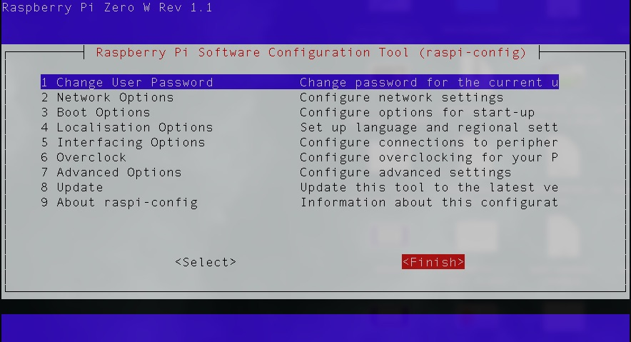

# Raspberry Piのパスワードを変更する

以下のコマンドを実行する

```
sudo raspi-config
```


`1 Change User Password`を選択してEnterを入力する


`<OK>` でEnterを入力する

```
Enter new UNIX password: 
```

と表示されるので、任意の新しいパスワードを入力する。入力中のパスワードは表示されない

```
Retype new UNIX password:
```

先程入力した同じパスワードを入力する。入力中のパスワードは表示されない


`<OK>` でEnterを入力する



TABキーを2回入力し、`<Finish>`にカーソルを合わせてEnterを入力すると終了する