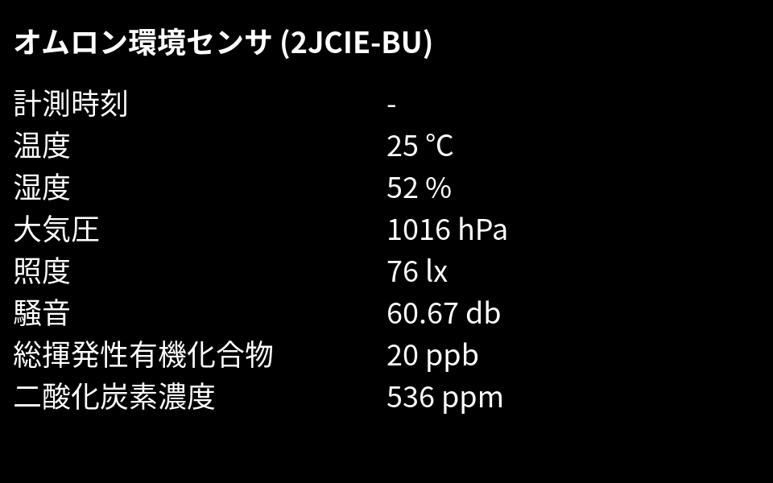

# webAgent



webAgent のセットアップを行うことで、環境センサー (OMRON 2JCIE-BU) から得られた現在の値をディスプレイ上に表示することが出来ます。

## セットアップ方法

前提として、事前にディスプレイと Raspberry Pi 本体を含むデータ収集環境一式を準備します。
[SD カードの編集だけでできる IoT 環境データ収集](../Workshop)のページを参考にしてください。

現在の値を画面上に表示するためには、以下の 3 つを実施します。

1. ディスプレイを Raspberry Pi に接続
2. webAgent の有効化
3. 再起動

ここでは webAgent の有効化する方法を詳しく説明します。

## webAgent の有効化

microSD カードの中にある、設定ファイル config.js を書き換えます。
config.js の書き変える方法は[SD カードの編集だけでできる IoT 環境データ収集](../Workshop)のページを参考にしてください。
次のコードのように、webAgent.enable を `true` に書き換えましょう。

```js
module.exports = [
  {
    // ...
    ,
    webAgent: {
      enable: true,
    }
  }
];
```

以上で、次回再起動後、Raspberry Pi で http://localhost:3000 にアクセス出来るようになり、画面上に現在の値を表示することが出来ます。

### ある条件のとき通知する設定

計測した値がある条件を満たすとき、画面を点滅させることによって視覚的に通知することが可能です。
例えば、温度が 25℃ を超えた時、画面を点滅させるには、以下のように webAgent.notifyWhen を書き加えます。

```diff
        enable: true,
+       notifyWhen: ({ temperature }) => temperature > 25
```

```js
module.exports = [
  {
    // ...
    ,
    webAgent: {
      enable: true,
      notifyWhen: ({ temperature }) => temperature > 25
    }
  }
];
```

詳しくは開発者向け補足を参照してください。

### webAgent を無効化するには

config.js の webAgent.enable を `false` にします。

```js
module.exports = [
  {
    // ...
    ,
    webAgent: {
      enable: false
    }
  }
];
```

## 開発者向け補足

- 設定ファイル config.js は pizero-workshop.js と omron-iot-sensor-web-agent によって読み込む
- pizero-workshop.js に関するドキュメントは、[pizero-workshop for developers](pizero-workshopForDevelopers)を参照
- omron-iot-sensor-web-agent は環境センサー (OMRON 2JCIE-BU) から得られた値を Web ページとして配信するためのモジュール
- インターネットに接続することなくローカル環境で表示することが可能

### キオスクモードの有効化

起動後、画面を全画面で表示するようにするためにキオスクモードを有効化するには、ターミナルで次のコマンドを実行してください。

~/pizero-workshop ディレクトリにある install.sh の実行:

```sh
sudo ~/pizero-workshop/install.sh -setupKiosk
```

#### キオスクモードを無効化するには

次のコマンドを実行します。

```sh
sudo ~/pizero-workshop/install.sh -teardownKiosk
```

### 通知設定

ある特定の条件で画面を点滅させるには、 webAgent.notifyWhen で設定することが可能です。
webAgent.notifyWhen には、[JavaScript の関数式](https://developer.mozilla.org/ja/docs/Web/JavaScript/Reference/Functions/Arrow_functions)を与えましょう。
この関数は計測する度に実行されます。
この関数の戻り値が `true` (真) のとき、通知が画面に送られ、画面が点滅します。

引数には計測値を含むオブジェクトが得られます。
オブジェクトに含まれるパラメーターは、次のとおりです。

| パラメーター       | 型     | 単位 | 説明                   |
| ------------------ | ------ | ---- | ---------------------- |
| temperature        | number | ℃    | 温度                   |
| relativeHumidity   | number | %    | 相対湿度               |
| barometricPressure | number | hPa  | 大気圧                 |
| ambientLight       | number | lx   | 照度                   |
| soundNoise         | number | db   | 騒音                   |
| eTVOC              | number | ppb  | 総揮発性有機化合物濃度 |
| eCO2               | number | ppm  | 二酸化炭素濃度         |

webAgent.notifyWhen を省略すると、デフォルトではいかなる場合も画面上に通知されません。

### 環境変数

| 環境変数 | 説明                            |
| -------- | ------------------------------- |
| PORT     | ポート番号、デフォルトでは 3000 |

/etc/systemd/system/pizero-workshop.service に Environment を書き加えることで変更可能です。

例:

```diff
  [Service]
+ Environment=PORT=80
```
