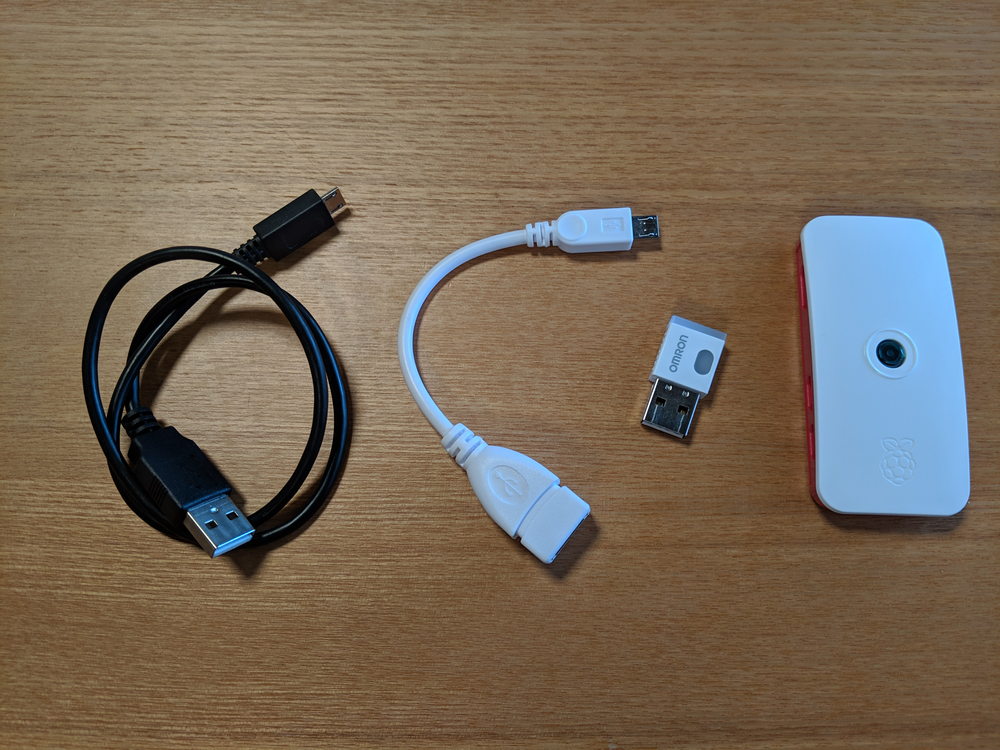
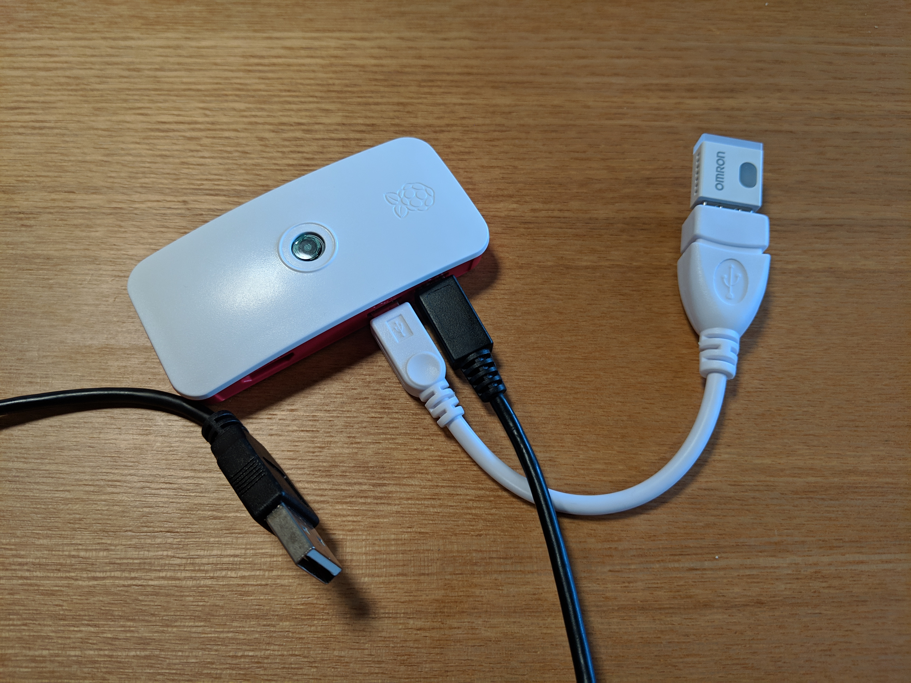
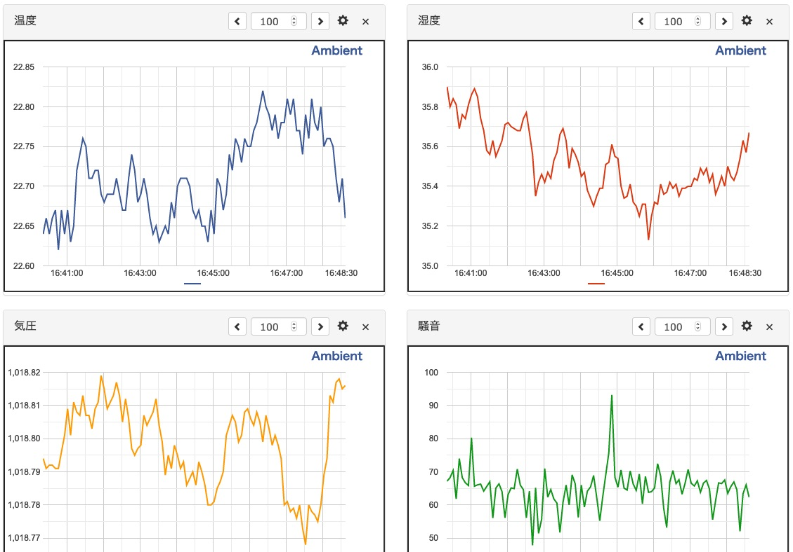

# Getting Started

## Raspberry Pi を組み立てる

Raspberry Pi (以下 RPi)、[OMRON 環境センサ (2JCIE-BU)](https://www.fa.omron.co.jp/products/family/3724/)、USB 変換アダプタ、USB ケーブルを用意します



各部品を写真のように組み立てます。RPi の USB ポートは同じ型のポートが 2 つあります。各ケーブルの接続場所を間違えないようにしてください。コネクタに向かって右側 (写真で黒いケーブルが繋がっている方) が電源ポート、左側が PC との通信や環境センサーへの給電・接続に利用します。



## Raspberry Pi に PC でログインする

RPi の USB ケーブルを PC の USB ポートに接続します

PPi の電源が入り OS が起動するので 1 分ほど待ちます

SSH クライアントを起動して、以下のコマンドを入力します。`-xxxx.local` の部分は各自の RPi に設定されているホスト名に読み替えてください

```sh
ssh pi@raspberrypi-xxxx.local
```

パスワードの入力を求められます。パスワードは `raspberry` です

```sh
pi@raspberrypi:~ $
```

というプロンプトが表示されれば、ログイン成功です

## プログラムを編集する

テキストエディタで `config.js` を開きます

```js
module.exports = {
  "NAME": "Rbt",
  "ADDRESS": "[YOUR BU01 ADDRESS NO SEMICOLON]",
  "INTERVAL_MILLISEC": 30000,
  "AMBIENT_CHANNEL": [YOUR AMBIENT CHANNEL ID],
  "AMBIENT_WRITE_ID": "[YOUR AMBIENT WRITE ID]"
};
```

ファイルの内容を下記に変更します

`[YOUR BU01 ADDRESS NO SEMICOLON]` を環境センサのアドレス(セミコロンを除いたもの)に変更

ファイルを上書き保存します

## テストプログラムをアップロードする

SSH クライアントにて、次のコマンドで作業用のディレクトリを作成します

```sh
mkdir src
```

SFTP クライアントを起動して、`pi@raspberrypi-xxxx.local` にログインします

`src` ディレクトリにプログラムファイルをアップロードします

SSH クライアントにて、プログラムファイルのディレクトリに移動し、プログラムが使用するライブラリをインストールします

```sh
cd src/Omron2jceBu01
npm install
```

以下のコマンドでテストプログラムを実行します

```sh
node test.js
```

以下のように表示されれば成功です。初期設定では 30 秒に一度の頻度でセンサーの値を読み取ります。プログラムの実行を中断するには `Ctrl+C` キーを押してください。

```
Test Start!
{"companyId":725,"dataType":1,"sequenceNo":156,"temperature":22.56,"relativeHumidity":36.11,"ambientLight":89,"barometricPressure":1018.616,"soundNoise":51.74,"eTVOC":35,"eCO2":634,"reserveForFutureUse":255}
{"companyId":725,"dataType":1,"sequenceNo":161,"temperature":22.59,"relativeHumidity":36.07,"ambientLight":91,"barometricPressure":1018.624,"soundNoise":56.37,"eTVOC":33,"eCO2":620,"reserveForFutureUse":255}
{"companyId":725,"dataType":1,"sequenceNo":166,"temperature":22.57,"relativeHumidity":35.96,"ambientLight":91,"barometricPressure":1018.627,"soundNoise":55.39,"eTVOC":30,"eCO2":597,"reserveForFutureUse":255}
...
```

## データ内容の説明

表示されるデータは、オムロン環境センサがセンシングした環境データです。データの中で必要な項目を説明します

```json
{
  "companyId": 725,
  "dataType": 1,
  "sequenceNo": 156,
  "temperature": 22.56,
  "relativeHumidity": 36.11,
  "ambientLight": 89,
  "barometricPressure": 1018.616,
  "soundNoise": 51.74,
  "eTVOC": 35,
  "eCO2": 634,
  "reserveForFutureUse": 255
}
```

- `temperature`: 温度(degC)
- `relativeHumidity`: 相対湿度(%RH)
- `ambientLight`: 照度(Lx)
- `barometricPressure`: 大気圧(hPa)
- `soundNoise`: 騒音(dB)
- `eTVOC`: 総揮発性有機化合物濃度(ppb)
- `eCO2`: 二酸化炭素濃度(ppm)

## Ambient をセットアップする

Web ブラウザで IoT データの可視化サービス [Ambient](https://ambidata.io) にアクセスし、新規アカウントを作成します

Ambient にログインし、新しいチャネルを作成します

作成したチャネルの `チャネルID`、`ライトキー` をメモ帳などに控えておきます

## メインプログラムを実行する

テキストエディタで `config.js` を開きます

```js
module.exports = {
  "NAME": "Rbt",
  "ADDRESS": "112233AABBCC",
  "INTERVAL_MILLISEC": 30000,
  "AMBIENT_CHANNEL": [YOUR AMBIENT CHANNEL ID],
  "AMBIENT_WRITE_ID": "[YOUR AMBIENT WRITE ID]"
};
```

ファイルの内容を下記に変更します

`[YOUR AMBIENT CHANNEL ID]` を先程控えた `チャネルID` に変更  
`[YOUR AMBIENT WRITE ID]` を先程控えた `ライトキー` に変更

`config.js` を RPi にアップロードして上書きします

以下のコマンドを実行します

```js
node main.js
```

以下のように表示されれば成功です

```
Scan Start!
{"companyId":725,"dataType":1,"sequenceNo":113,"temperature":22.65,"relativeHumidity":35.74,"ambientLight":87,"barometricPressure":1018.635,"soundNoise":50.4,"eTVOC":28,"eCO2":588,"reserveForFutureUse":255}
Ambient: 200
{"companyId":725,"dataType":1,"sequenceNo":118,"temperature":22.73,"relativeHumidity":35.61,"ambientLight":87,"barometricPressure":1018.64,"soundNoise":58.76,"eTVOC":28,"eCO2":588,"reserveForFutureUse":255}
Ambient: 200
{"companyId":725,"dataType":1,"sequenceNo":123,"temperature":22.74,"relativeHumidity":35.59,"ambientLight":87,"barometricPressure":1018.638,"soundNoise":57.62,"eTVOC":22,"eCO2":545,"reserveForFutureUse":255}
Ambient: 200
...
```

[Ambient](https://ambidata.io)にログインし作成したチャネルにアクセスします

データがグラフ表示されていれば成功です。



Ambient に送信されグラフに表示される値は `main.js` プログラムの中では次の用に定義されており、温度、相対湿度、大気圧、照度、騒音、総揮発性有機化合物濃度、二酸化炭素濃度の順番になっています:

```js
const ambData = {
  d1: envData.temperature,
  d2: envData.relativeHumidity,
  d3: envData.barometricPressure,
  d4: envData.ambientLight,
  d5: envData.soundNoise,
  d6: envData.eTVOC,
  d7: envData.eCO2
};
```
