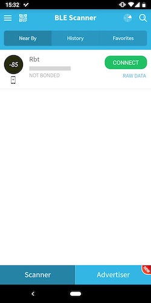
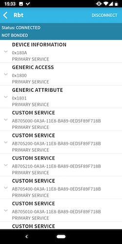
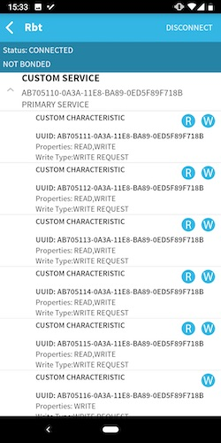
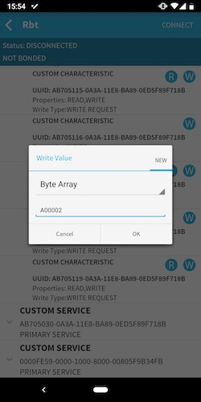
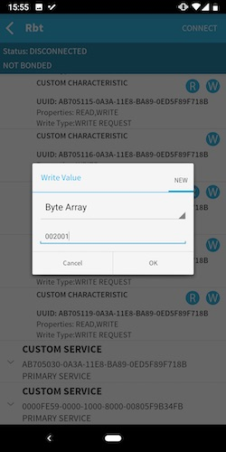

# 環境センサをカスタマイズする

## 環境センサの設定

オムロン環境センサはBluetooth経由でCharacteristicを変更することで様々なカスタマイズを行うことができる

方法について詳しくは[ユーザマニュアル](https://www.fa.omron.co.jp/products/family/3724/download/manual.html)を参照。本ドキュメントで説明するカスタマイズはユーザマニュアルP38に記載がある

以降に登場する`0x0000`といったバイト値はビッグエンディアンで表記されており、設定する時はリトルエンディアンに読み替える必要がある

## 2JCIE-BU01に接続する

プロファイルにアクセスするには、[BLE Scanner for Android](https://play.google.com/store/apps/details?id=com.macdom.ble.blescanner&hl=ja)等を用いると便利

以下ではBLE Scanerを用いた変更方法を記載する

BLE Scannerを起動する。2JCIE-BU01はデフォルトで`Rbt`という名前になっている。`Rbt`の`CONNECT`ボタンをタップする

## データタイプを変更する

Characteristics UUID `0x5115`の下位1バイトがアドバタイジングモードの設定である。デフォルトは`0x01`本プログラムではモード`0x01`と`0x02`に対応している。各モードのデータ構成はユーザマニュアルP59以降の`3. BLE Advertising packet`の章を参照

BLE ScannerでCUSTOM SERVICE の中からUUIDの先頭が `AB705110`になっているものを探す

その下のCUSTOM CHARACTERISTICの先頭が`AB705115`になっているものを探す

`W`ボタンをタップしてセレクトボックスから`Byte Array`を選択し、その下のテキストボックスに`A00002`と入力してOKボタンをタップする

## アドバタイジングの送信間隔を変更する

Characteristics UUID `0x5115`の上位2バイトがアドバタイジングの送信間隔である。デフォルトは`0x00A0`で、100msとなっている。仕様は以下(ユーザーマニュアルP38に記載)

* Range: 0x00A0 to 0x4000 (100ms to 10.24s)
* Unit: 0.625ms
* Default: 0x00A0 (100ms)

BLE ScannerでCUSTOM SERVICE の中からUUIDの先頭が `AB705110`になっているものを探す

その下のCUStOM CHARACTERISTICの先頭が`AB705115`になっているものを探す

例えば約5秒間隔に変更するには、`W`ボタンをタップしてセレクトボックスから`Byte Array`を選択し、その下のテキストボックスに`002001`と入力してOKボタンをタップする

