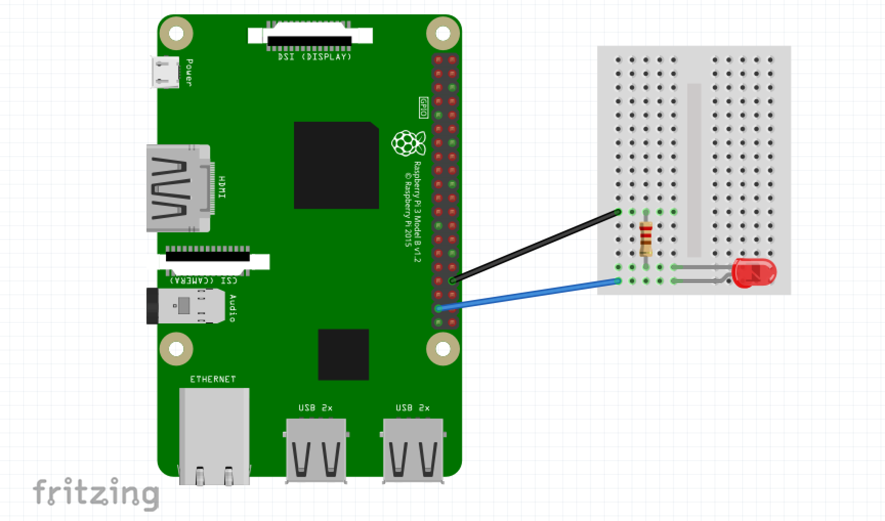

# 設定ファイルのサンプルコード集

応用的な使い方として、いくつか具体的なサンプルコードを実際の設定ファイルから抜粋しています。
基本的な使い方は、[基本的な使い方](../basic-usage.md)を参照してください。

## 例: 7 時から 19 時の間、温度と VOC の測定値に応じて定型文を読み上げる

Speech Agent (計測値の読み上げ機能) を使った例です。あらかじめ、[現在の値をスピーカーで読み上げる](../usage/speech-agent.md)を参照して、Speech Agent を利用できるように準備してください。

```js
speechAgent: {
  enable: true,
  notifyWhen: () => {
    const hours = new Date().getHours();
    return 7 <= hours && hours < 19;
  },
  notifyScript: ({ temperature, eTVOC }) => {
    return [
      temperature <= 18 ? "暖房を入れましょう" : null,
      28 <= temperature ? "暖房を切りましょう" : null,
      600 <= eTVOC ? "換気をしましょう" : null
    ].join("、");
  }
},
```

## 例: 湿度が 40%以下のとき外部に接続した LED を点滅させる

あらかじめ LED を Raspberry Pi の GPIO26 (BCM)と GND に接続してください。

```
GPIO26---|>|---[100-470 Ohm]---GND
```



```js
speechAgent: {
  enable: true,
  notifyScript: ({ relativeHumidity }) => {
    const { writeFileSync: write } = require("fs");
    const sleep = require("util").promisify(setTimeout);
    const ledPin = 26; // LEDをRaspberry PiのGPIO26 (BCM)に接続する
    try {
      write("/sys/class/gpio/export", ledPin);
    } catch (e) {}
    try {
      write(`/sys/class/gpio/gpio${ledPin}/direction`, "out");
    } catch (e) {}
    async function blink() {
      try {
        for (let i = 0; i < 10; i++) {
          write(`/sys/class/gpio/gpio${ledPin}/value`, 1);
          await sleep(1000);
          write(`/sys/class/gpio/gpio${ledPin}/value`, 0);
          await sleep(1000);
        }
      } catch (e) {}
    }
    if (relativeHumidity <= 40) {
      blink();
      return `湿度${relativeHumidity}パーセントです。`;
    }
    return "";
  }
},
```

## 例: Speech Agent と GPIO を組み合わせた複雑な条件の通知

### 条件

| パラメーター | 条件式                                | 動作                                                 |
| ------------ | ------------------------------------- | ---------------------------------------------------- |
| 騒音         | `70 <= soundNoise && soundNoise < 90` | GPIO 20 が一定回数 High/Low の出力を繰り返す         |
| 騒音         | `90 <= soundNoise`                    | GPIO 26 が一定回数 High/Low の出力を繰り返す         |
| 温度         | `26 <= temperature`                   | `温度${temperature}度です` と読み上げる              |
| 相対湿度     | `50 <= relativeHumidity`              | `湿度${relativeHumidity}パーセントです` と読み上げる |
| VOC          | `100 <= eTVOC`                        | `総揮発性有機化合物濃度${eTVOC}ppbです` と読み上げる |

配線としては、GPIO 20 に黄色の LED のアノード、GPIO 26 に赤色の LED のアノードを接続します。
LED のカソードには 100Ω から 470Ω 程度の抵抗を介して Raspberry Pi の GND 端子に接続します。

配線図:

```
GPIO20---|>|---[100-470 Ohm]---GND
GPIO26---|>|---[100-470 Ohm]---GND
```

### 設定例

```js
speechAgent: {
  enable: true,
  notifyScript: ({ soundNoise, temperature, relativeHumidity, eTVOC }) => {
    const { writeFileSync: write } = require("fs");
    const sleep = require("util").promisify(setTimeout);
    async function blink(pin) {
      try {
        write("/sys/class/gpio/export", pin);
      } catch (e) {}
      try {
        write(`/sys/class/gpio/gpio${pin}/direction`, "out");
      } catch (e) {}

      try {
        for (let i = 0; i < 10; i++) {
          write(`/sys/class/gpio/gpio${pin}/value`, 1);
          await sleep(1000);
          write(`/sys/class/gpio/gpio${pin}/value`, 0);
          await sleep(1000);
        }
      } catch (e) {}
    }
    // LEDをRaspberry PiのGPIO 20, GPIO 26 (BCM)に接続する
    if (70 <= soundNoise && soundNoise < 90) blink(20);
    if (90 <= soundNoise) blink(26);

    return [
      26 <= temperature && `温度${temperature}度です`,
      50 <= relativeHumidity && `湿度${relativeHumidity}パーセントです`,
      100 <= eTVOC && `総揮発性有機化合物濃度${eTVOC}ppbです`
    ]
      .filter(Boolean)
      .join("、");
  }
},
```

ピン配置の参考資料: https://www.raspberrypi.org/documentation/usage/gpio/
