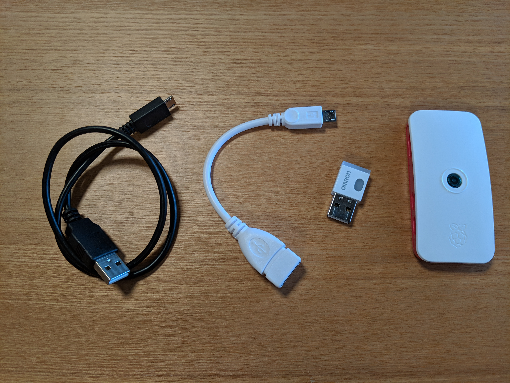
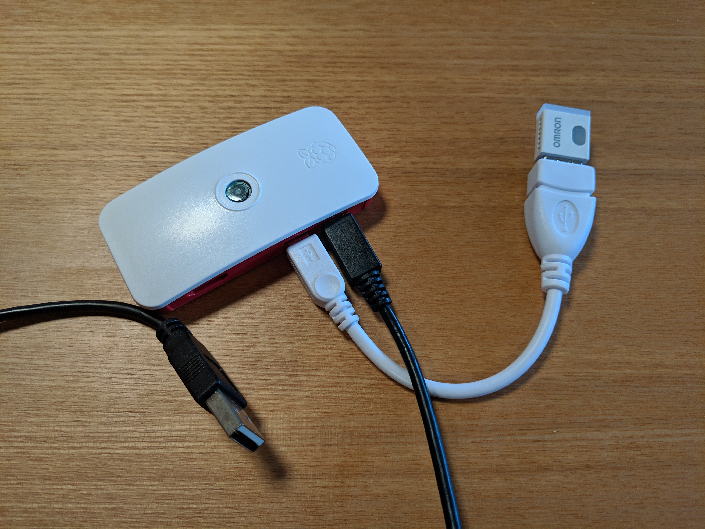
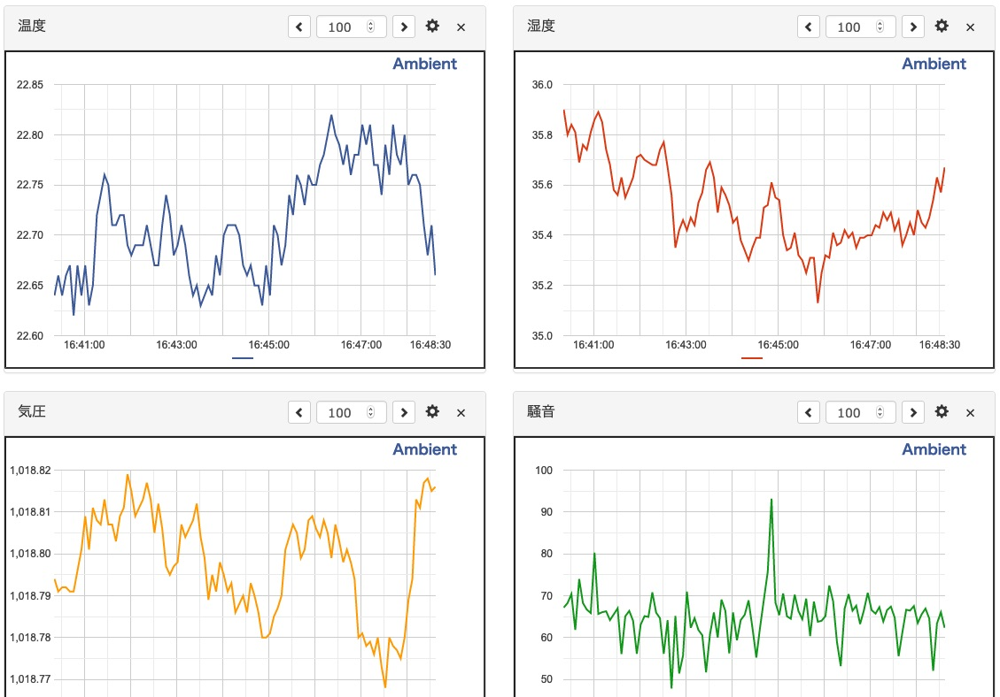

# Getting Started

## Raspberry Piを組み立てる

Raspberry Pi (以下 RPi)、OMRON環境センサ、USB変換アダプタ、USBケーブルを用意します



各部品を写真のように組み立てます。RPiのUSBポートは同じ型のポートが2つあります。各ケーブルの接続場所を間違えないようにしてください



## Raspberry PiにPCでログインする

RPiのUSBケーブルをPCのUSBポートに接続します  

PPiの電源が入りOSが起動するので1分ほど待ちます  

SSHクライアントを起動して、以下のコマンドを入力します。`-xxxx.local`の部分は各自のホスト名に読み替えてください

```
ssh pi@raspberrypi-xxxx.local
```

パスワードの入力を求められます。パスワードは `raspberry` です

```
pi@raspberrypi:~ $
```

というプロンプトが表示されれば、ログイン成功です

## プログラムを編集する

テキストエディタで `config.js` を開きます  

```
module.exports = {
  "NAME": "Rbt",
  "ADDRESS": "[YOUR BU01 ADDRESS NO SEMICOLON]",
  "INTERVAL_MILLISEC": 5000,
  "AMBIENT_CHANNEL": [YOUR AMBIENT CHANNEL ID],
  "AMBIENT_WRITE_ID": "[YOUR AMBIENT WRITE ID]"
};
```

ファイルの内容を下記に変更します  

`[YOUR BU01 ADDRESS NO SEMICOLON]`を環境センサのアドレス(セミコロンを除いたもの)に変更  

ファイルを上書き保存します


## テストプログラムをアップロードする

SSHクライアントにて、次のコマンドで作業用のディレクトリを作成します

```
mkdir src
```

SFTPクライアントを起動して、`pi@raspberrypi-xxxx.local` にログインします  

`src`ディレクトリにプログラムファイルをアップロードします  

SSHクライアントにて、プログラムファイルのディレクトリに移動します  

```
cd src/Omron2jceBu01
```

以下のコマンドを実行します

```
node test.js
```

以下のように表示されれば成功です  

```
Test Start!
{"companyId":725,"dataType":1,"sequenceNo":156,"temperature":22.56,"relativeHumidity":36.11,"ambientLight":89,"barometricPressure":1018.616,"soundNoise":51.74,"eTVOC":35,"eCO2":634,"reserveForFutureUse":255}
{"companyId":725,"dataType":1,"sequenceNo":161,"temperature":22.59,"relativeHumidity":36.07,"ambientLight":91,"barometricPressure":1018.624,"soundNoise":56.37,"eTVOC":33,"eCO2":620,"reserveForFutureUse":255}
{"companyId":725,"dataType":1,"sequenceNo":166,"temperature":22.57,"relativeHumidity":35.96,"ambientLight":91,"barometricPressure":1018.627,"soundNoise":55.39,"eTVOC":30,"eCO2":597,"reserveForFutureUse":255}
...
```

## データ内容の説明

表示されるデータは、オムロン環境センサがセンシングした環境データです。データの中で必要な項目を説明します  

```
{
  "companyId": 725,
  "dataType": 1,
  "sequenceNo": 156,
  "temperature": 22.56,
  "relativeHumidity": 36.11,
  "ambientLight": 89,
  "barometricPressure": 1018.616,
  "soundNoise": 51.74,
  "eTVOC": 35,
  "eCO2": 634,
  "reserveForFutureUse": 255
}
```

* `temperature`: 温度(degC)
* `relativeHumidity`: 相対湿度(%RH)
* `ambientLight`: 照度(Lx)
* `barometricPressure`: 大気圧(hPa)
* `soundNoise`: 騒音(dB)
* `eTVOC`: 総揮発性有機化合物濃度(ppb)
* `eCO2`: 二酸化炭素濃度(ppm)

## Ambientをセットアップする

Webブラウザで[Ambient](https://ambidata.io)にアクセスし、新規アカウントを作成します  

Ambientにログインし、新しいチャネルを作成します  

作成したチャネルの `チャネルID`、`ライトキー` をメモ帳などに控えておきます  

## メインプログラムを実行する

テキストエディタで `config.js` を開きます  

```
module.exports = {
  "NAME": "Rbt",
  "ADDRESS": "112233AABBCC",
  "INTERVAL_MILLISEC": 5000,
  "AMBIENT_CHANNEL": [YOUR AMBIENT CHANNEL ID],
  "AMBIENT_WRITE_ID": "[YOUR AMBIENT WRITE ID]"
};
```

ファイルの内容を下記に変更します  

`[YOUR AMBIENT CHANNEL ID]`を先程控えた`チャネルID`に変更  
`[YOUR AMBIENT WRITE ID]`を先程控えた`ライトキー`に変更  

`config.js` をRPiにアップロードして上書きします  

以下のコマンドを実行します

```
node main.js
```

以下のように表示されれば成功です  

```
Scan Start!
{"companyId":725,"dataType":1,"sequenceNo":113,"temperature":22.65,"relativeHumidity":35.74,"ambientLight":87,"barometricPressure":1018.635,"soundNoise":50.4,"eTVOC":28,"eCO2":588,"reserveForFutureUse":255}
Ambient: 200
{"companyId":725,"dataType":1,"sequenceNo":118,"temperature":22.73,"relativeHumidity":35.61,"ambientLight":87,"barometricPressure":1018.64,"soundNoise":58.76,"eTVOC":28,"eCO2":588,"reserveForFutureUse":255}
Ambient: 200
{"companyId":725,"dataType":1,"sequenceNo":123,"temperature":22.74,"relativeHumidity":35.59,"ambientLight":87,"barometricPressure":1018.638,"soundNoise":57.62,"eTVOC":22,"eCO2":545,"reserveForFutureUse":255}
Ambient: 200
...
```

[Ambient](https://ambidata.io)にログインし作成したチャネルにアクセスします  

データがグラフ表示されていれば成功です  


